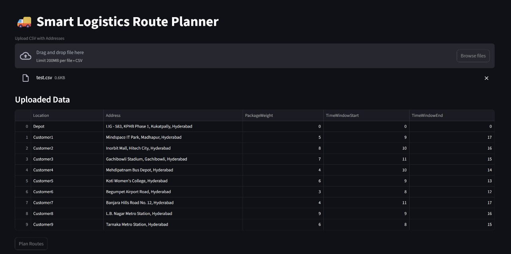
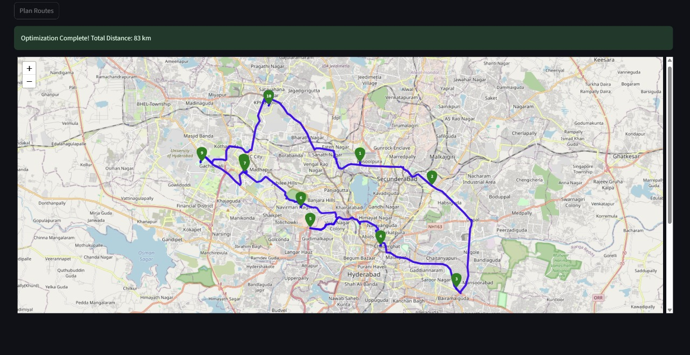

# 🚚 SmartRouteX – AI-powered Route Optimization for Last-Mile Logistics

SmartRouteX is a real-world-ready logistics route planner that optimizes delivery or pickup routes using Google Maps and Google OR-Tools. Designed for logistics companies, delivery startups, and route-based businesses, the app finds the most efficient paths between a central depot and multiple delivery points based on travel distance, time windows, and package load.

> 📍 View optimized routes on an interactive map with clearly numbered stops  
> ⚙️ Integrate real road conditions with Google Directions API  
> 🖥️ Simple UI built with Streamlit for demo or deployment  

---

## ✨ Features

- 🔢 **Route Optimization** using OR-Tools (Vehicle Routing Problem)
- 📦 **Time Window & Load Constraints** (e.g., weight, delivery time)
- 🗺️ **Accurate Road Routing** via Google Maps Directions API
- 📍 **Interactive Map Visualization** using Folium
- 🧭 **Stop Order Indicators** for clear driver instructions
- 📤 Upload delivery data via CSV with address, weight, and time constraints

---

## 📸 Demo Screenshots




---

## 🚀 Getting Started

### 🔧 Prerequisites

- Python 3.8+
- Google Maps API key (enable Geocoding + Directions APIs)

### 🔌 Installation

```bash
git clone https://github.com/yourusername/smartroutex.git
cd smartroutex
pip install -r requirements.txt
